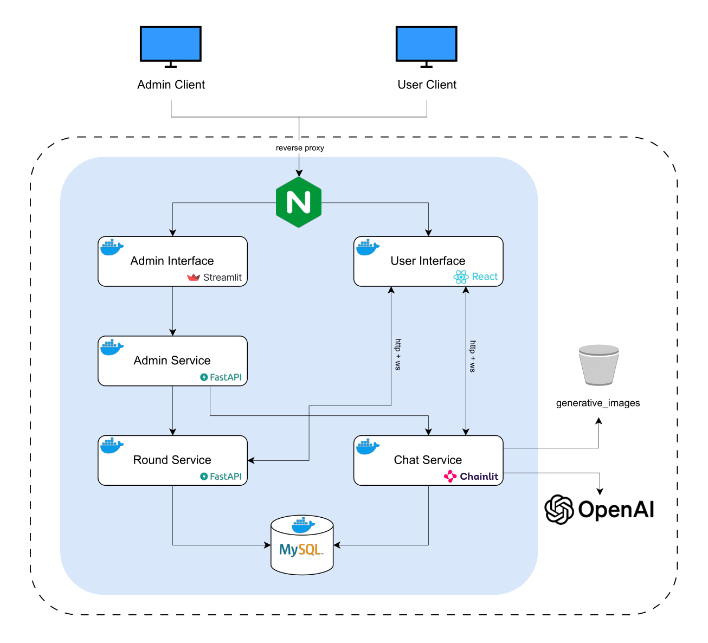

# Theme Prompt Clash
Theme Prompt Clash is an innovative interactive game that leverages generative AI to create a competitive and creative experience. 

The application allows up to 5 players to compete in image generation rounds using OpenAI's DALL-E model.

In each round, players are given a specific theme and time limit. They must craft creative text prompts that generate images related to the theme. These AI-generated images are then evaluated by an admin, which selects the most creative and thematically appropriate submission as the winner.

### Demo
https://github.com/user-attachments/assets/bb0fdb37-63c0-4298-af06-1512433f46aa

## Table of Contents
- [Game Mechanics](#game-mechanics)
- [Architecture](#architecture)
  - [Components](#architecture-components)
  - [Diagram](#architecture-diagram)
- [Prerequisites](#prerequisites)
  - [Required Services](#required-services-and-subscriptions)
  - [Software Requirements](#software-requirements)
- [Deployment Options](#deployment-options)
  - [Local Development](#run---locally)
  - [Docker Compose](#deploy---docker-compose)
- [Alternative Configurations](#alternative-cloud-providers-and-configurations)

## Game Mechanics

- Participants compete in image generation rounds using OpenAI's DALL-E
- Each round accommodates up to 5 simultaneous participants
- Players receive a specific theme and time limit at the start of each round
- Participants write creative prompts to generate images related to the assigned theme ([prompt examples](https://generrated.com/?model=dalle2))
- An admin evaluates and selects the most creative image at the end of each round

## Architecture Diagram


## Architecture Components

The application consists of several microservices:

1. **Chat Service**: Handles user interactions and image generation via OpenAI's DALL-E
2. **Round Manager Service**: Manages game rounds, themes, and timing
3. **Admin Service**: Provides backend functionality for the admin interface
4. **User Interface**: React-based frontend for players
5. **Admin Interface**: Streamlit-based dashboard for game administrators
6. **Database Service**: MySQL database for persistent storage

## Prerequisites

Before running the application, ensure you have the following:

### Required Services and Subscriptions

- **OpenAI API Key**: Required for DALL-E image generation
- **Oracle Cloud Infrastructure (OCI) Account**: 
  - Needed for image storage in the `generative_images` bucket
  - Configure OCI credentials (Access Key ID and Secret Access Key)
  - Set up an OCI Object Storage bucket named `generative_images`

### Software Requirements

- Python 3.9.2
- Node.js 22.13.1
- MySQL 8.0 or later
- Docker and Docker Compose (for containerized deployment)

# Local Development
Download and install Python version 3.9.2, you can find it [HERE](https://www.python.org/downloads/release/python-392/).

Install poetry:
```bash
pip install poetry==2.0.1
```

Install Node & pnpm:
```bash
winget install Schniz.fnm # restart shell
fnm install 22.13.1 # restart shell
node -v # if it doesn't work, add it to PATH
npm -v
npm install -g pnpm
```

## Set up environment variables
Create `.env` files in each service directory with the required environment variables (you can start from `env.example`):
```yaml
# For chat_service/.env
MYSQL_HOST=localhost
MYSQL_PORT=3306
MYSQL_USER=app_user
MYSQL_PASSWORD=app_password
MYSQL_DB=chainlit_db
OPENAI_API_KEY=your_openai_api_key
CHAINLIT_AUTH_SECRET=your_auth_secret
# Add other required variables
```

Repeat this process for each service directory.

## Chat Service

### Installation
```bash
cd chat_service
poetry install --no-root
```

### Run
```bash
poetry shell
uvicorn app:app --host 0.0.0.0 --port 8000
```

## Round Manager Service

### Installation
```bash
cd round_manager_service
poetry install --no-root
```

### Run
```bash
poetry shell
uvicorn app:app --host 0.0.0.0 --port 8001
```

## Admin Service

### Installation
```bash
cd admin_service
poetry install --no-root
```

### Run
```bash
poetry shell
uvicorn app:app --host 0.0.0.0 --port 8002
```

## User Interface

### Installation
```bash
cd user_interface
pnpm install
pnpm buildUi
```

### Run
```bash
cd app
pnpm dev --port 5174
```

## Admin Interface

### Installation
```bash
cd admin_interface
poetry install --no-root
```

### Run
```bash
poetry shell
streamlit run app.py
```

# Docker Compose

## Set up environment variables
Create `.env-docker` files in each service directory with the required environment variables (you can start from env.example):
```yaml
   # For chat_service/.env-docker
   MYSQL_HOST=database_service
   MYSQL_PORT=3306
   MYSQL_USER=app_user
   MYSQL_PASSWORD=app_password
   MYSQL_DB=chainlit_db
   OPENAI_API_KEY=your_openai_api_key
   CHAINLIT_AUTH_SECRET=your_auth_secret
   # Add other required variables
```

Repeat this process for each service directory.

## Build and Launch
Build each component and launch it:
```bash
docker-compose up --build
```

## Access the application
- User Interface: `http://localhost:3000`
- Admin Interface: `http://localhost:8501`

# Alternative Cloud Providers and Configurations

## Storage Options
While this implementation uses Oracle Cloud Infrastructure (OCI) for image storage, Chainlit natively supports multiple storage clients:
- **Amazon S3**: Can be used by configuring AWS credentials
- **Google Cloud Storage (GCS)**: Can be used with GCP credentials
- **Azure Blob Storage**: Can be used with Azure credentials

To use an alternative storage provider, update the relevant environment variables in your configuration files and modify the storage client initialization in the code.

## Database Options
The current implementation uses MySQL with a custom data layer, but Chainlit natively supports PostgreSQL. If you prefer PostgreSQL:
1. Replace the MySQL container in docker-compose.yml with PostgreSQL
2. Update the database connection string in your environment variables
3. You can use Chainlit's built-in PostgreSQL data layer instead of the custom MySQL data layer

This would simplify the implementation as you wouldn't need to create a custom data layer like the one in `chat_service/data/mysql_data_layer.py`.
